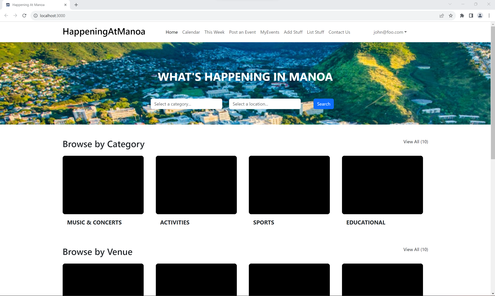
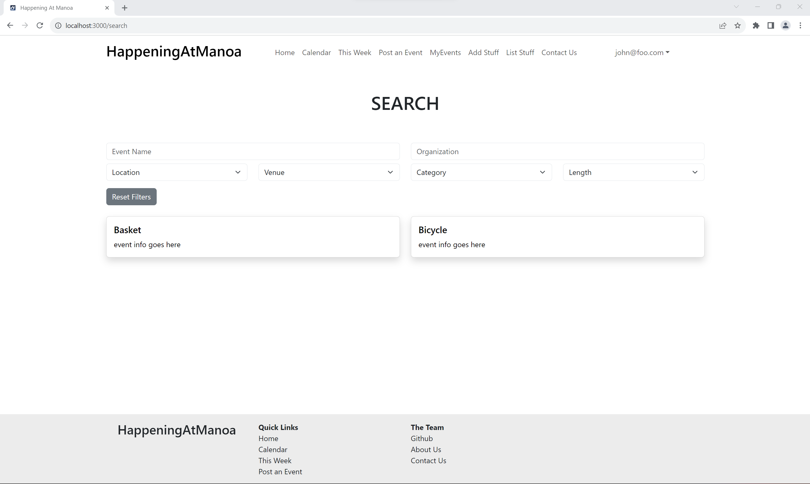

# Happening At Manoa

## Overview

Happening At Manoa is an application for members of the UH Manoa community to see what events are going on in their community as well as search for events that aligns with their interests. Our goal is to help build connectivity within the UH Manoa community with an application that will make knowing about and attending events more convenient.

## The Team

- Benjamin Crawford
- Anthony Lee
- Erin Murata
- Raven Quiddaoen
- Leah Yanagisawa

## Our Github

View our organization on Github [here](https://github.com/happeningatmanoa).

## Team Contract

Our team's code of conduct can be found in the [Team Contract](https://docs.google.com/document/d/1G973eUKhsXuxS8ETUO21Ykb6mgbJwUbbN-DVYe3XoCo/edit?usp=sharing).

## Application Mockup

Here are what we envision our final product to be.

### Landing Page

Features of the Landing Page
- Navigation Bar
- Search Bar
- Category Carousel
- Venue Carousel
- Featured Events
- Footer

### Calendar Page

Features of the Calendar Page
- Calendar showing a month at a time
- Events for that month
- Ability to view events on specific days

### Event Page

Features of the Post an Event Page
- Navigation Bar
- User form to request to post an event
  - Attributes to help categorize the event
  - Image upload for thumbnails and supporting images
  - Description of the event
  - Request for submission
- Footer

### MyEvents Page

Features of the MyEvents Page
- View user's upcoming events
- View user's past attended events

### Profile Page

Features of the Profile Page
- View user profile
- Edit user profile

### Search Page

Features of the Search Page
- Search for events by keyword
- Search for events by category
- Search for events by location

## Deployment

A link to our running application is [here](http://137.184.104.184/).

## User Interface Walkthrough

### Landing Page

Anyone visiting the site should have access to the landing page. It should show the application name on the top right, navbar on the top, filters to search for events in the header, and two carousels showing images of upcoming events.

### Search Page

Anyone visiting the site can also search through the events in the database through the search page. They have the option of searching by category or location location, or by typing in search terms.

### MyEvents Page

When a user signs up or logs in, they can click on the "MyEvents" link in the navbar and be taken to a list of events they have signed up for notifications for. This includes upcoming events as well as past events.

### Contact Us Page

Users can contact us through this page. Each of our names redirects to opening an email with our respective hawaii.edu email address. Users who are event organizers can contact us to request a higher level of permissions to create and post events.

### About Us Page

Anyone using the application can view this page to see the members behind the creation of this application. An overview of our goal is at the top and a collection of our pictures are below.

## Project Milestones

[Project Milestone 1](https://github.com/orgs/happeningatmanoa/projects/4)

[Project Milestone 2](https://github.com/orgs/happeningatmanoa/projects/2)

[Project Milestone 3](https://github.com/orgs/happeningatmanoa/projects/7)
