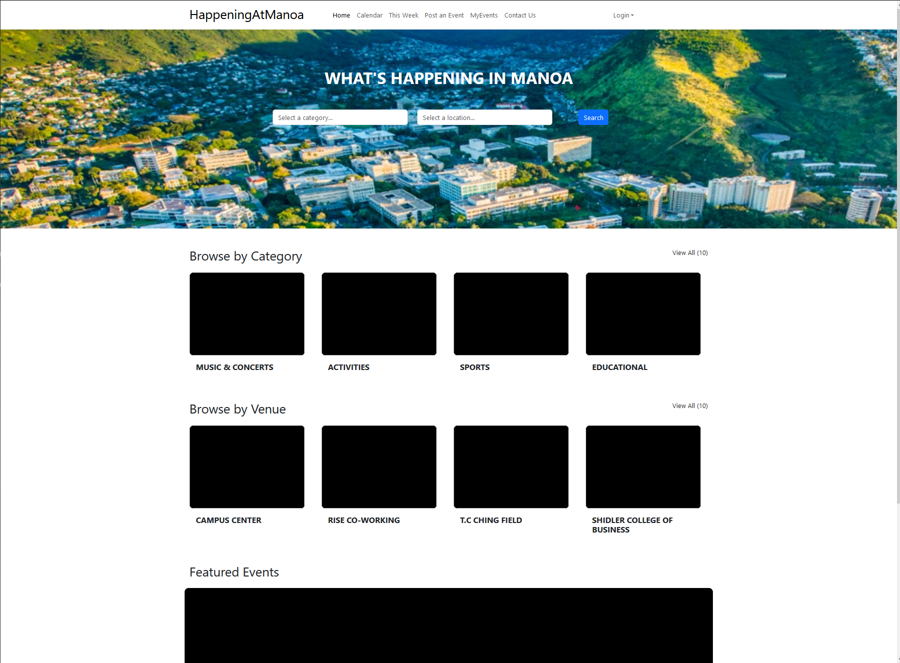

# Happening At Manoa

## Overview

Happening At Manoa is an application for members of the UH Manoa community to see what events are going on in their community as well as search for events that aligns with their interests. Our goal is to help build connectivity within the UH Manoa community with an application that will make knowing about and attending events more convenient.

## The Team

- Benjamin Crawford
- Anthony Lee
- Erin Murata
- Raven Quiddaoen
- Leah Yanagisawa

## Our Github

View our organization on Github [here](https://github.com/happeningatmanoa).

## Developer Installation Guide

Installation guide is currently located at the bottom-most subsection of this page for readability's sake.

## Team Contract

Our team's code of conduct can be found in the [Team Contract](https://docs.google.com/document/d/1G973eUKhsXuxS8ETUO21Ykb6mgbJwUbbN-DVYe3XoCo/edit?usp=sharing).

## Application Mockup

Here are what we envision our final product to be.

### Landing Page


Features of the Landing Page
- Navigation Bar
- Search Bar
- Category Carousel
- Venue Carousel
- Featured Events
- Footer

### Calendar Page


Features of the Calendar Page
- Calendar showing a month at a time
- Events for that month
- Ability to view events on specific days

### Event Page


Features of the Post an Event Page
- Navigation Bar
- User form to request to post an event
  - Attributes to help categorize the event
  - Image upload for thumbnails and supporting images
  - Description of the event
  - Request for submission
- Footer

### MyEvents Page


Features of the MyEvents Page
- View user's upcoming events
- View user's past attended events

### Profile Page


Features of the Profile Page
- View user profile
- Edit user profile

### Search Page


Features of the Search Page
- Search for events by keyword
- Search for events by category
- Search for events by location

## Deployment

A link to our running application is [here](http://137.184.104.184/).



### The State of our Application

Happening At Manoa should currently have a working landing page. Most components in the navbar do work, but not all pages they lead to are done. Login is functional.

## Project Milestones

[Project Milestone 1](https://github.com/orgs/happeningatmanoa/projects/4)

[Project Milestone 2](https://github.com/orgs/happeningatmanoa/projects/2)

## Developer Installation Guide (Cont.)

### Downloads

First, [install Meteor](https://www.meteor.com/install).

Second, [download a copy of Happening at Manoa](https://github.com/RavenMarQ/digits).

Third, go to your newly downloaded copy of Happening at Manoa and cd into the /app directory of the folder via Shell or Command Prompt.

Fourth, install the required libraries using the Shell/Command prompt with the following command:

```
$ meteor npm install
```

### Running the system

Once the libraries are installed, you can run the application by invoking the "start" script in the [package.json file](https://github.com/ics-software-engineering/meteor-application-template-react/blob/master/app/package.json):

```
$ meteor npm run start
```

The first time you run the app, it will create some default users and data. Here is the output:

```
> happeningatmanoa@ start C:\Users\user\Desktop\happeningatmanoa\app
> meteor --no-release-check --exclude-archs web.browser.legacy,web.cordova --settings ../config/settings.development.json

[[[[[ C:\Users\user\Desktop\happeningatmanoa\app ]]]]]

=> Started proxy.
=> Started HMR server.
=> Started MongoDB.                           
I20231106-13:12:34.236(-10)? Creating the default user(s)
I20231106-13:12:34.249(-10)?   Creating user admin@foo.com.
I20231106-13:12:34.466(-10)?   Creating user john@foo.com.
I20231106-13:12:34.579(-10)? Creating default contact.
I20231106-13:12:34.579(-10)?   Adding: Johnson (john@foo.com)
I20231106-13:12:34.601(-10)?   Adding: Casanova (john@foo.com)
I20231106-13:12:34.603(-10)?   Adding: Binsted (admin@foo.com)
=> Started your app.

=> App running at: http://localhost:3000/
```

Periodically, you might see `Error starting Mongo (2 tries left): Cannot run replSetReconfig because the node is currently updating its configuration` after the `=> Started HMR server.`. It doesn't seem to be a problem since the MongoDB does start.

### Viewing the running app

If all goes well, the template application will appear at [http://localhost:3000](http://localhost:3000). Default log-in credentials to be supplied at a later date, simply create an account to get started.