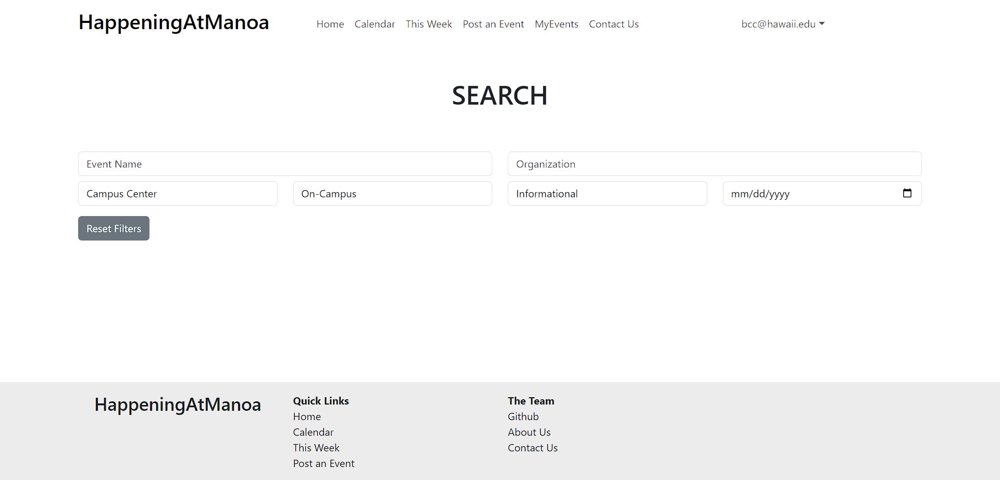

# Happening At Manoa

## Table of Contents

- [Overview](#overview)
- [The Team](#the-team)
- [Our Github](#our-github)
- [Developer Guide](#developer-installation-guide)
- [Team Contract](#team-contract)
- [Deployment](#deployment)
- [User Walkthrough](#user-interface-walkthrough)
- [Project Milestones](#project-milestones)
- [Application Mockup](#application-mockup)

## Overview

Happening At Manoa is an application for members of the UH Manoa community to see what events are going on in their community as well as search for events that aligns with their interests. Our goal is to help build connectivity within the UH Manoa community with an application that will make knowing about and attending events more convenient.

## The Team

- Benjamin Crawford
- Anthony Lee
- Erin Murata
- Raven Quiddaoen
- Leah Yanagisawa

## Our Github

View our organization on Github [here](https://github.com/happeningatmanoa).

## Developer Installation Guide

Installation guide is currently located at the bottom-most subsection of this page for readability's sake.

[Jump to Developer Installation Guide](#developer-installation-guide-cont)

## Team Contract

Our team's code of conduct can be found in the [Team Contract](https://docs.google.com/document/d/1G973eUKhsXuxS8ETUO21Ykb6mgbJwUbbN-DVYe3XoCo/edit?usp=sharing).

## Deployment

Our running application is [here](http://134.209.160.180/). It is currently not working.

## User Interface Walkthrough

### Landing Page

Anyone visiting the site should have access to the landing page. It should show the application name on the top right, navbar on the top, filters to search for events in the header, and two carousels showing images of upcoming events.


### Search Page

Anyone visiting the site can also search through the events in the database through the search page. They have the option of searching by category or location location, or by typing in search terms.



### MyEvents Page

When a user signs up or logs in, they can click on the "MyEvents" link in the navbar and be taken to a list of events they have signed up for notifications for. This includes upcoming events as well as past events.


### Contact Us Page

Users can contact us through this page. Each of our names redirects to opening an email with our respective hawaii.edu email address. Users who are event organizers can contact us to request a higher level of permissions to create and post events.


### About Us Page

Anyone using the application can view this page to see the members behind the creation of this application. An overview of our goal is at the top and a collection of our pictures are below.


## Project Milestones

Here were our goals throughout this project, separated into Milestones. They can also be found on our organization's Github.

[Project Milestone 1](https://github.com/orgs/happeningatmanoa/projects/4)

[Project Milestone 2](https://github.com/orgs/happeningatmanoa/projects/2)

[Project Milestone 3](https://github.com/orgs/happeningatmanoa/projects/7)

## Application Mockup

At the start of this project, we had made a handful of mockups to better envision the end goal of our project. Here's what some of them look like.

### Landing Page


Features of the Landing Page
- Navigation Bar
- Search Bar
- Category Carousel
- Venue Carousel
- Featured Events
- Footer

### Calendar Page


Features of the Calendar Page
- Calendar showing a month at a time
- Events for that month
- Ability to view events on specific days

### Event Page


Features of the Post an Event Page
- Navigation Bar
- User form to request to post an event
    - Attributes to help categorize the event
    - Image upload for thumbnails and supporting images
    - Description of the event
    - Request for submission
- Footer

### MyEvents Page


Features of the MyEvents Page
- View user's upcoming events
- View user's past attended events

### Profile Page


Features of the Profile Page
- View user profile
- Edit user profile

### Search Page


Features of the Search Page
- Search for events by keyword
- Search for events by category
- Search for events by location

## Developer Installation Guide (Cont.)

### Downloads

First, [install Meteor](https://www.meteor.com/install).

Second, [download a copy of Happening at Manoa](https://github.com/RavenMarQ/digits).

Third, go to your newly downloaded copy of Happening at Manoa and cd into the /app directory of the folder via Shell or Command Prompt.

Fourth, install the required libraries using the Shell/Command prompt with the following command:

```
$ meteor npm install
```

### Running the system

Once the libraries are installed, you can run the application by invoking the "start" script in the [package.json file](https://github.com/ics-software-engineering/meteor-application-template-react/blob/master/app/package.json):

```
$ meteor npm run start
```

The first time you run the app, it will create some default users and data. Here is the output:

```
> happeningatmanoa@ start C:\Users\user\Desktop\happeningatmanoa\app
> meteor --no-release-check --exclude-archs web.browser.legacy,web.cordova --settings ../config/settings.development.json

[[[[[ C:\Users\user\Desktop\happeningatmanoa\app ]]]]]

=> Started proxy.
=> Started HMR server.
=> Started MongoDB.                           
I20231106-13:12:34.236(-10)? Creating the default user(s)
I20231106-13:12:34.249(-10)?   Creating user admin@foo.com.
I20231106-13:12:34.466(-10)?   Creating user john@foo.com.
I20231106-13:12:34.579(-10)? Creating default contact.
I20231106-13:12:34.579(-10)?   Adding: Johnson (john@foo.com)
I20231106-13:12:34.601(-10)?   Adding: Casanova (john@foo.com)
I20231106-13:12:34.603(-10)?   Adding: Binsted (admin@foo.com)
=> Started your app.

=> App running at: http://localhost:3000/
```

Periodically, you might see `Error starting Mongo (2 tries left): Cannot run replSetReconfig because the node is currently updating its configuration` after the `=> Started HMR server.`. It doesn't seem to be a problem since the MongoDB does start.

### Viewing the running app

If all goes well, the template application will appear at [http://localhost:3000](http://localhost:3000). Default log-in credentials to be supplied at a later date, simply create an account to get started.
